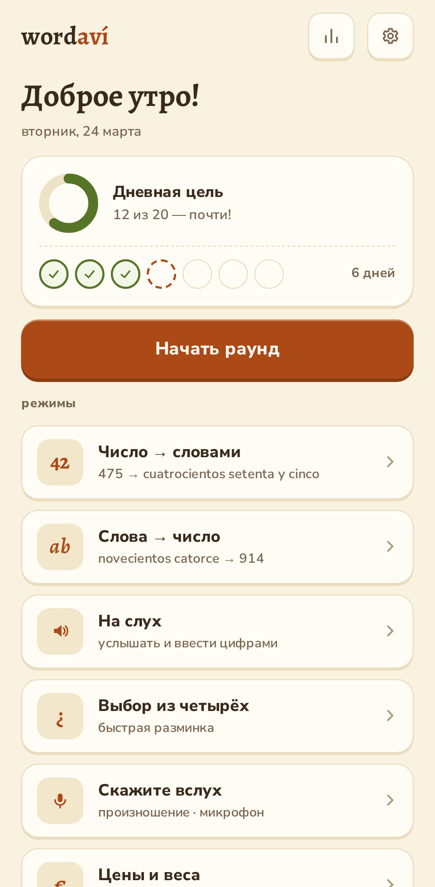
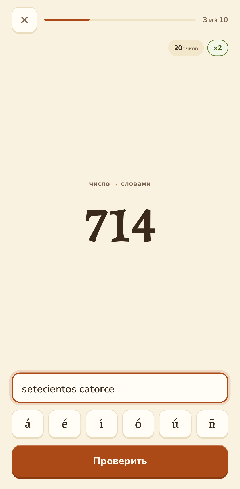
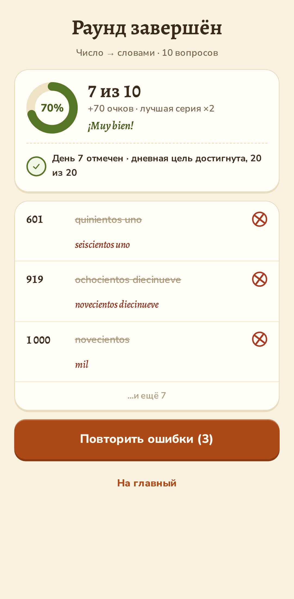
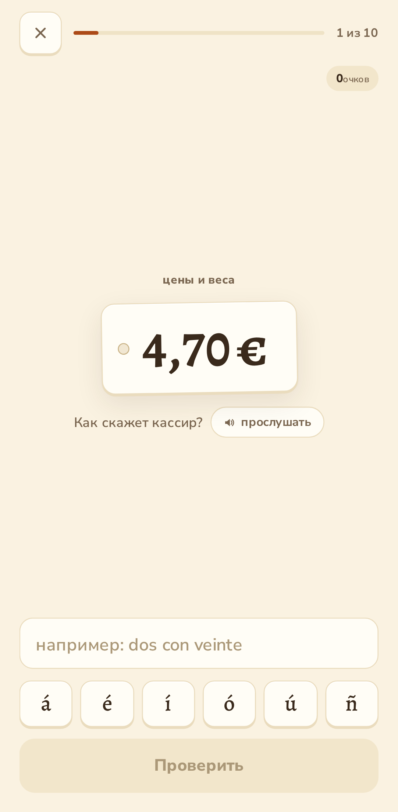

# wordavi

Learn Spanish numbers — integers, decimals, prices, and grocery quantities. Built for the moments that actually matter: understanding a cashier, reading a price tag, weighing produce.

**[Open wordavi.com](https://wordavi.com)** · [Documentation](https://docs.wordavi.com)

No account, no sign-up, nothing to pay. Install it and it works with no internet at all. Your progress stays on your own device — there is no server to send it to.

## What it looks like

  
  
  
  

Tap any screen to see it full size.

**Home** — the daily goal fills as you answer, the row of stamps is your streak, and the big button plays a mixed round drawn from every mode your device can run.

**A question** — read `714`, write it in Spanish. The accent row is right under the field, and the score and combo tick along at the top.

**The summary** — misses come first, each with the correction underneath: `quinientos uno` was really `seiscientos uno`. One button replays just those, and chains until they are clean.

**Prices and weights** — a shelf tag asks what the cashier would say. Every phrasing a real person uses is accepted, including `medio kilo` for 500 grams.

## How practice works

Six ways to practise: read a numeral in Spanish, type what you hear as digits, listen and write, pick from four, say it out loud, and grocery prices and weights.

Answers are judged the way a patient teacher would. A missing accent — `dieciseis` for `dieciséis` — counts as "almost": it still scores, keeps your combo, and shows you the accent you missed. A genuinely wrong form like `veinte y uno` is marked wrong, with the correct one shown before you move on.

What you get wrong comes back. The app tracks which kinds of numbers you find hard — the teens, the irregular hundreds, prices with cents — and asks more of those, then quietly retires a question once you have answered it right twice in a row.

## Installing it

Onboarding offers this first, and it is worth doing: an installed copy opens from your home screen and works offline. Chrome and Edge show a real install button; on an iPhone use Share → "Add to Home Screen"; Brave and Firefox keep it in the browser menu, and the app tells you where to look. You can also install later from Settings.

## Your data

Everything lives in your browser on your device. Nothing is uploaded, and there is no tracking or analytics of any kind. Clearing your browser data or switching phones means starting over, so Settings has **Download data** and **Restore from file** to move your progress yourself.

The one exception: the "say it out loud" mode uses your browser's speech recognition, which sends the audio to your browser vendor to be transcribed. That is why it needs an internet connection. wordavi itself never keeps what you said.

## For developers

The commands, the repo layout, and the things about the test suites that would otherwise cost you an afternoon are in **[the development note](https://docs.wordavi.com/development)**. Start there rather than here.

The rest of [docs.wordavi.com](https://docs.wordavi.com) covers the [architecture](https://docs.wordavi.com/architecture/overview), the [Spanish grammar the engine encodes](https://docs.wordavi.com/architecture/spanish-number-rules), and a [decision record](https://docs.wordavi.com/decisions/) for every significant choice.

## License

[MIT](LICENSE)
