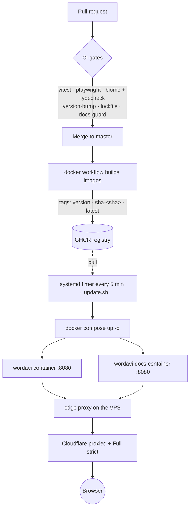

## From a change to a running container

wordavi is a pure static site, so "deploy" means **build an image, push it to a
registry, and let the VPS pull it**. There is no runtime server to update and no
database to migrate. This note traces a change from a pull request all the way
to a browser. For what actually runs inside the container, see [[overview]].

Every release since the first has gone out this way, including the app itself.

## The flow

## 1. Pull-request gates

Every PR targets `master` (direct pushes are not allowed) and must pass the CI
workflow before it can merge:

| Gate | What it checks |
| --- | --- |
| **test** | `pnpm test` — Vitest unit tests, including the engine tables in [[spanish-number-rules]] and the layer import bans from [[layers]] |
| **e2e** | a production build, checked to prove it does not ship the component gallery, then Playwright on an emulated phone and on desktop Chrome, with an accessibility scan of every screen in both themes |
| **lint** | `biome ci .` plus the `tsc` typecheck |
| **version-bump** | `package.json` version must **increase** versus the base branch |
| **lock-check** | `pnpm-lock.yaml` is up to date and frozen |
| **docs-guard** | *warns* if `src/`, `deploy/`, or `.github/` changed without a `docs/` update |

The **version-bump** gate is what makes rollback possible: the version is
single-sourced in `package.json` and shown in the app footer, and CI refuses any
PR that does not bump it. The **docs-guard** is a warning, not a blocker — it
nudges these notes to stay honest when code or infra moves.

## 2. Merge → image build and tags

A merge to `master` triggers the **docker** workflow. It builds two images with
the multi-stage `Dockerfile` (node:26-alpine build stage → `pnpm build` →
nginx-unprivileged serving the static `dist/`):

- `wordavi` — the app.
- `wordavi-docs` — this documentation site (built with Quartz). The docs image
  only rebuilds when docs-related paths change, or on a manual / scheduled run.

Each image is pushed to **GHCR** with three tags:

| Tag | Purpose |
| --- | --- |
| `<version>` (e.g. `0.1.0`) | immutable, human-readable release marker |
| `sha-<commit>` | exact provenance for any build |
| `latest` | moving pointer to the newest default-branch build |

A Trivy scan runs against the built image for HIGH/CRITICAL findings. There are
**no git tags or GitHub releases** — the image tags are the release ledger, and
the `<version>` / `sha-` tags are what a rollback pins to.

## 3. VPS timer → pull → containers

The VPS runs the two containers via `docker compose`, attached to an external
Docker network (`edge`) with **no published host ports**. A **systemd timer
fires every 5 minutes** and runs the deploy script, which:

1. records the currently running image digests,
2. runs `docker compose pull` then `docker compose up -d`,
3. reports only if the images actually changed, and prunes dangling images.

By default it pulls the `latest` tag. **Rollback** is pinning the app image to a
known-good `<version>` (e.g. `IMAGE_TAG=0.1.0`) and letting the same script
converge to it — no manual container surgery.

This pull-based model was chosen over an auto-updater daemon watching the socket:
the timer + script keeps updates ordinary, auditable `compose` runs with no
extra privileged, socket-mounted container in the mix.

## 4. Edge proxy → Cloudflare → browser

A standalone **edge proxy** on the same `edge` network terminates the public
side and reverse-proxies by hostname to the containers (`8080` each), including a
`www` → apex redirect. The full shape of what is deployed — the two containers,
their private network, and the proxy — is described in [[deployment]]. In front
of it:

- **Cloudflare** proxies all traffic (orange-cloud) and terminates public TLS.
- The origin presents a **Cloudflare Origin Certificate** and the connection is
  **Full (strict)**.
- The origin firewall accepts `80`/`443` **only from Cloudflare's address
  ranges**, so the VPS is not reachable directly.

nginx inside the container serves the SPA with an immutable, fingerprinted
`/assets/`, a no-cache `index.html` and service worker, a `/healthz` endpoint,
SPA fallback, and self-only security headers (CSP `default-src 'self'`). From
there the browser takes over and the PWA runs offline, as described in
[[overview]].

Caching differs too, and for the same reason the app fingerprints its assets:
Quartz emits none. Every documentation build overwrites the same `/postscript.js`
and `/static/contentIndex.json`, so those are served `no-cache` — anything cached
by URL would outlive the deploy that replaced it, and a browser running one
build's scripts against another build's pages fails silently rather than loudly.
Only the fonts are cached for a day.

The two sites carry **different policies**, in `deploy/security-headers.conf` and
`deploy/security-headers-docs.conf`. The app's forbids `eval`. This
documentation site has to allow it: Quartz draws the graph with PixiJS, which
compiles its shaders through `new Function`, and refusing that does not merely
lose the graph — the whole script bundle throws on load, taking the explorer and
the search with it. The trade is bounded by what this site is: static pages
built from markdown in the repository, with no user input, no accounts and no
data. The app, on its own origin, is unaffected.

## Summary

A PR that passes the gates, merges, and bumps the version becomes a tagged GHCR
image within one workflow; the VPS notices within five minutes and swaps the
container in place behind Cloudflare — with every prior `<version>` still sitting
in the registry as a one-line rollback.
