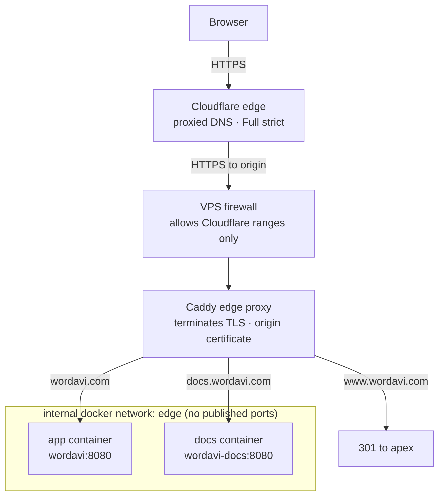

How wordavi is served in production: two small static containers on a private network, a standalone edge proxy terminating TLS, and Cloudflare in front of it all.

For day-to-day operation see [[runbook]]; for the DNS and certificate setup see [[cloudflare]].

## The two containers

The Compose project runs two services, both built on `nginx-unprivileged` serving a static build on port `8080`:

- **app** — the wordavi PWA, network alias `wordavi`.
- **docs** — this documentation site, network alias `wordavi-docs`.

Neither container publishes a port to the host. They join an **external Docker network named `edge`**, and are reached only by other members of that network — chiefly the edge proxy — using their aliases (`wordavi:8080`, `wordavi-docs:8080`).

Both services are hardened the same way: read-only root filesystem with a `tmpfs` for scratch, all Linux capabilities dropped, `no-new-privileges`, and modest memory / CPU / PID limits. Each ships a container health check against `/healthz`.

## The edge proxy

TLS is terminated by a **standalone Caddy** deployment — its own Compose project, also attached to the `edge` network. It does not build or manage the app; it only routes:

- `wordavi.com` &rarr; `wordavi:8080`
- `docs.wordavi.com` &rarr; `wordavi-docs:8080`
- `www.wordavi.com` &rarr; redirect to the apex

Caddy presents a **Cloudflare Origin Certificate** for `wordavi.com` and `*.wordavi.com` on the origin connection. Because the app containers expose no host ports, the edge proxy is the only path to them.

## Cloudflare in front

Public DNS is served by Cloudflare with the records **proxied** (orange-clouded), so browsers connect to Cloudflare, not directly to the VPS. The zone runs in **Full (strict)** mode: Cloudflare verifies the origin certificate presented by the edge proxy on the hop to the VPS.

The VPS firewall only accepts inbound `80`/`443` from **Cloudflare's published IP ranges**, so the origin cannot be reached by bypassing Cloudflare. Reproducible steps for the zone are in [[cloudflare]].

## Request path

## Why it is shaped this way

- **No published ports** means the only way in is through the edge proxy — the app is never exposed on the host directly.
- **Separate edge Compose project** keeps TLS and routing independent of app deploys: shipping a new app image never touches the proxy, and vice versa.
- **Full (strict) + origin firewall** closes the two classic origin bypasses — a stolen origin IP is useless without a Cloudflare-trusted request, and non-Cloudflare source IPs are dropped at the firewall.
